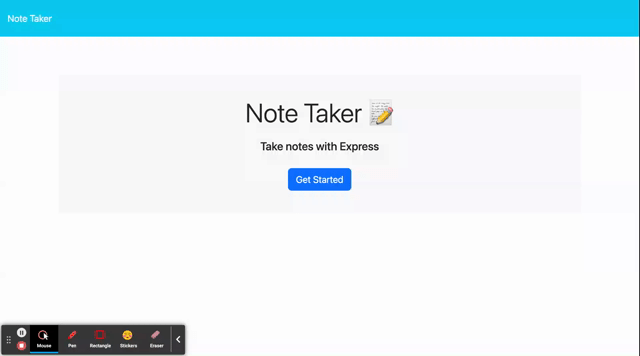

# Note-Taker

## Description

In this application I created a note taking app using Node.js and Express (Node.js Framework). The Express helped build the routes for handling HTTP requests to my server for creating notes (POST request), fetching saved notes (GET request), and deleting notes (DELETE request). This app is a useful note taking program developed to help people keep track of things on their mind.

### Take-Aways

- My motivation for this project was to increase my knowledge in server side code by using express to mange requests to my server.

- The problem my note taker app solved is that it helps people keep track of things in online.

- I learned about Node.js frameworks like Express to handle server requests.

## Usage

This appilcation is a note taking software.

- Type in your note title and text, you then have two options, you can either save the note or clear the form.
- You can also delete notes with the delete button on the side of the note

**[Deployed Application](https://note-taker-kp-aa6665bda0a7.herokuapp.com/)**

### Demo of the Application

## Credits

### Documentation

- [Express](https://expressjs.com/)
- [Node.js](https://nodejs.org/docs/latest/api/)

## License

Please refer to license in the repo.